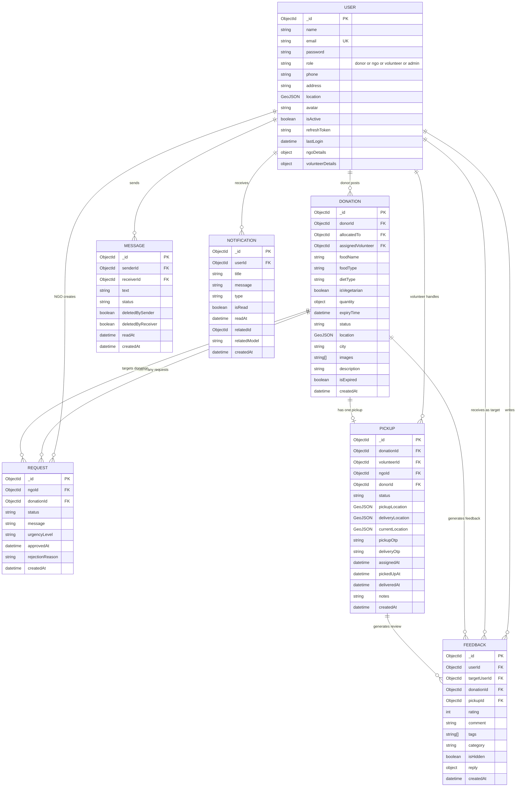
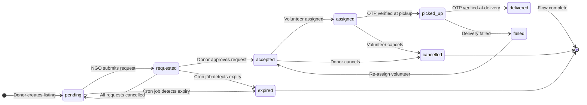

# NurishHub — System Diagrams

---

## 📊 1. Use Case Diagram

```mermaid
flowchart TB
    GUEST(["👤 Guest User"])
    DONOR(["🍱 Donor"])
    NGO(["🏢 NGO"])
    VOL(["🚴 Volunteer"])
    ADMIN(["🛡️ Admin"])

    subgraph SYSTEM ["🌐  NurishHub System"]

        subgraph AUTH ["🔐 Authentication"]
            UC1["Register / Login"]
            UC2["Refresh Token"]
            UC3["Change Password"]
            UC4["Logout"]
        end

        subgraph DONATE ["🍛 Donation Management"]
            UC5["Create Food Listing"]
            UC6["View / Search Donations"]
            UC7["Edit Donation"]
            UC8["Delete Donation"]
            UC9["Auto-Expire Donation (Cron)"]
        end

        subgraph REQUEST ["📋 Request & Approval"]
            UC10["Request a Donation"]
            UC11["Approve / Reject Request"]
            UC12["Cancel Request"]
            UC13["View My Requests"]
        end

        subgraph PICKUP ["🚚 Pickup & Logistics"]
            UC14["Assign Volunteer"]
            UC15["Accept Pickup Task"]
            UC16["Update Transit Status"]
            UC17["Share Live Location"]
            UC18["Verify Pickup OTP"]
            UC19["Verify Delivery OTP"]
            UC20["Auto-Assign Best Volunteer"]
        end

        subgraph CHAT ["💬 Communication"]
            UC21["Send / Receive Messages"]
            UC22["Typing Indicator"]
            UC23["Read Receipts"]
        end

        subgraph NOTIF ["🔔 Notifications"]
            UC24["View Notifications"]
            UC25["Mark as Read"]
            UC26["Real-time Push Alert"]
        end

        subgraph FEEDBACK ["⭐ Feedback"]
            UC27["Submit Rating / Review"]
            UC28["Reply to Feedback"]
            UC29["Hide Feedback"]
        end

        subgraph ADMIN_MOD ["⚙️ Admin Controls"]
            UC30["Verify NGO Account"]
            UC31["Deactivate User"]
            UC32["View Analytics Dashboard"]
            UC33["Manage All Donations"]
            UC34["Moderate Feedback"]
        end

    end

    GUEST --> UC1
    GUEST --> UC6

    DONOR --> UC1
    DONOR --> UC5
    DONOR --> UC6
    DONOR --> UC7
    DONOR --> UC8
    DONOR --> UC11
    DONOR --> UC14
    DONOR --> UC21
    DONOR --> UC24
    DONOR --> UC25
    DONOR --> UC27

    NGO --> UC1
    NGO --> UC6
    NGO --> UC10
    NGO --> UC12
    NGO --> UC13
    NGO --> UC17
    NGO --> UC21
    NGO --> UC24
    NGO --> UC25
    NGO --> UC27

    VOL --> UC1
    VOL --> UC15
    VOL --> UC16
    VOL --> UC17
    VOL --> UC18
    VOL --> UC19
    VOL --> UC21
    VOL --> UC24
    VOL --> UC25

    ADMIN --> UC1
    ADMIN --> UC30
    ADMIN --> UC31
    ADMIN --> UC32
    ADMIN --> UC33
    ADMIN --> UC29
    ADMIN --> UC34
    ADMIN --> UC20

    UC5 -.->|"triggers"| UC26
    UC11 -.->|"triggers"| UC26
    UC15 -.->|"triggers"| UC26
    UC16 -.->|"triggers"| UC26
    UC9 -.->|"triggers"| UC26

    style SYSTEM fill:#0f172a,stroke:#334155,color:#f8fafc
    style AUTH fill:#1e3a5f,stroke:#3b82f6,color:#bfdbfe
    style DONATE fill:#1a3a2a,stroke:#22c55e,color:#bbf7d0
    style REQUEST fill:#3a2a1a,stroke:#f97316,color:#fed7aa
    style PICKUP fill:#2a1a3a,stroke:#a855f7,color:#e9d5ff
    style CHAT fill:#3a1a2a,stroke:#ec4899,color:#fce7f3
    style NOTIF fill:#3a3a1a,stroke:#eab308,color:#fef9c3
    style FEEDBACK fill:#1a3a3a,stroke:#06b6d4,color:#cffafe
    style ADMIN_MOD fill:#3a1a1a,stroke:#ef4444,color:#fecaca
```

---

## 🗄️ 2. Entity Relationship Diagram (ERD)

---

## 📌 Key Relationships Summary

| Entity | Relates To | Relationship |
|---|---|---|
| User (Donor) | Donation | 1 Donor → Many Donations |
| User (NGO) | Request | 1 NGO → Many Requests |
| User (Volunteer) | Pickup | 1 Volunteer → 1 Active Pickup |
| Donation | Request | 1 Donation → Many Requests (1 approved) |
| Donation | Pickup | 1 Donation → 1 Pickup record |
| Pickup | User (Donor + NGO + Volunteer) | 3-way relationship |
| Feedback | User + Donation + Pickup | Links rater to target via donation/pickup |

---

## 🔄 3. Donation State Machine

